# Shoppingify Frontend

Solution for a challenge from [DevChallenges.io](https://web.archive.org/web/20231130033807/https://legacy.devchallenges.io/challenges/mGd5VpbO4JnzU6I9l96x).

## Table of Contents

- [Overview](#overview)
  - [Screenshots](#screenshots)
  - [Built With](#built-with)
- [Features](#features)
- [How to use](#how-to-use)
- [Thoughts](#thoughts)
- [Continued Development](#continued-development)
- [Useful Resources](#useful-resources)
- [Acknowledgements](#acknowledgements)

## Overview

### Screenshots

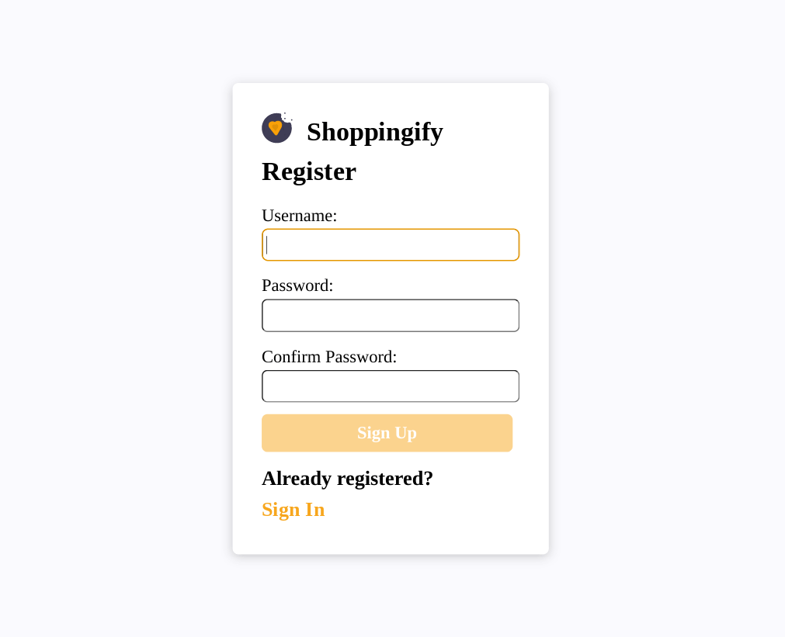

***

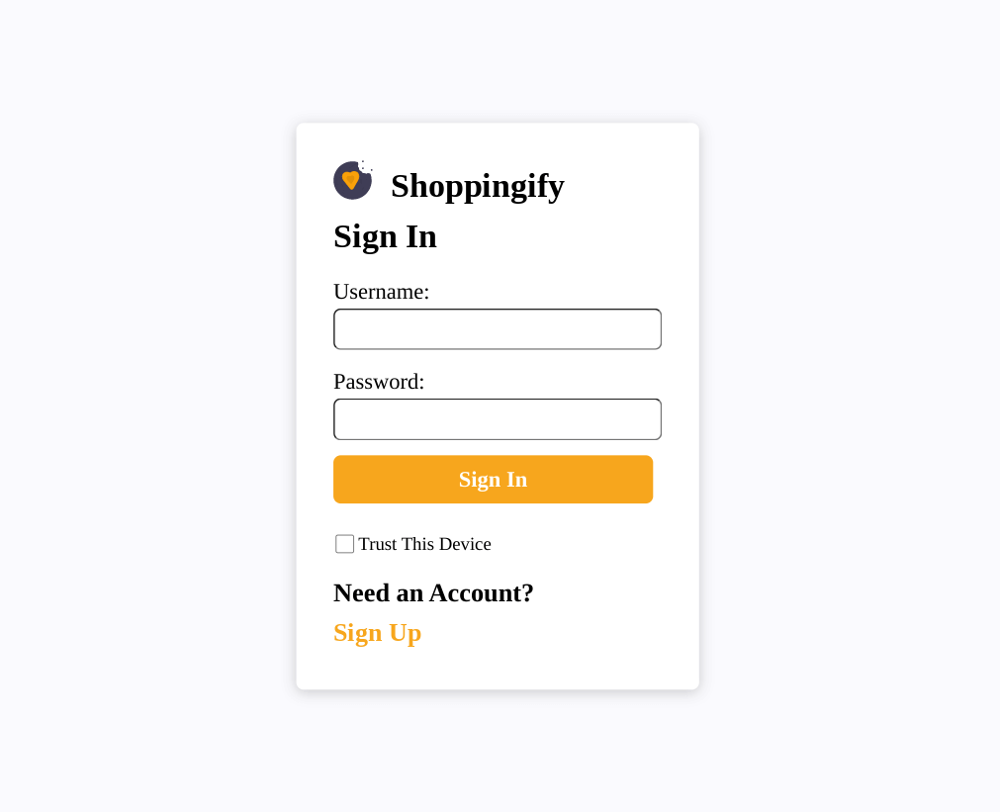

***

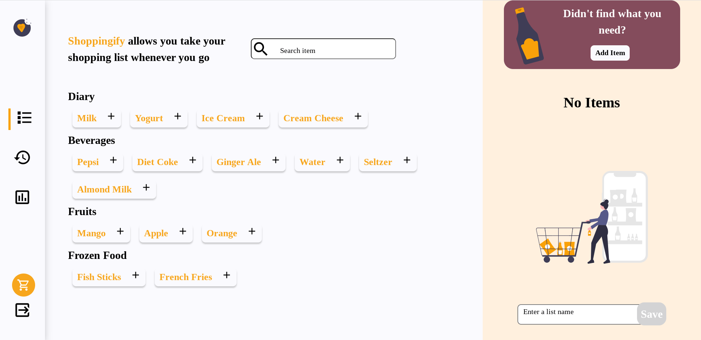

***

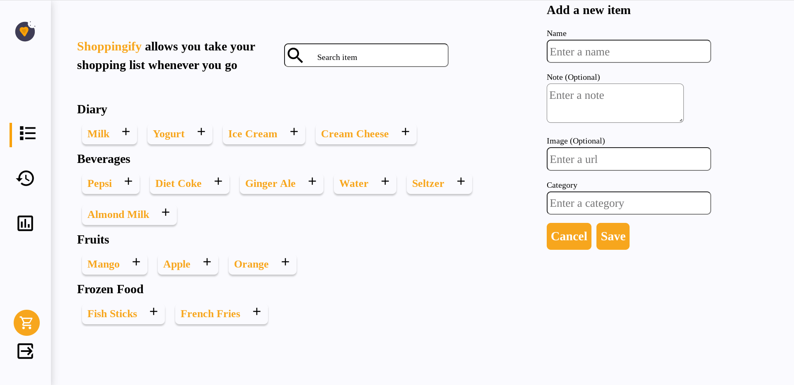

***

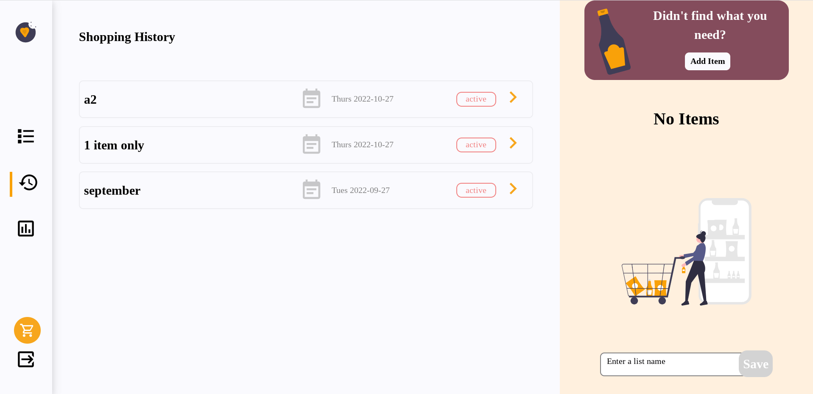

***

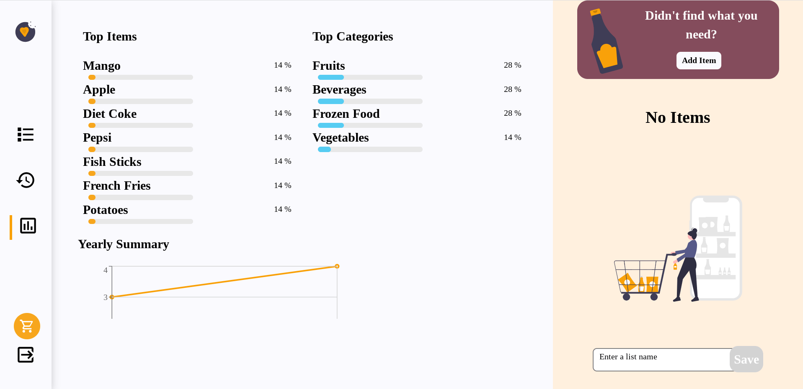

***

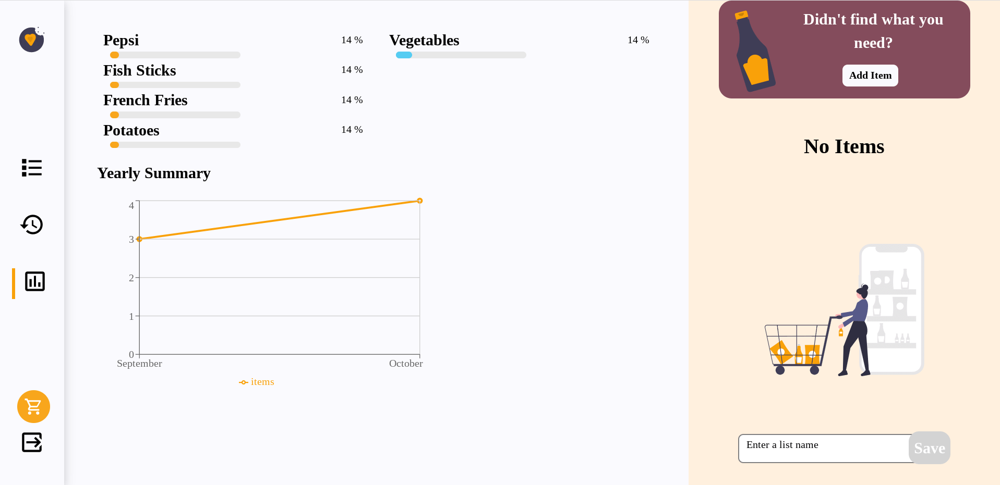

***

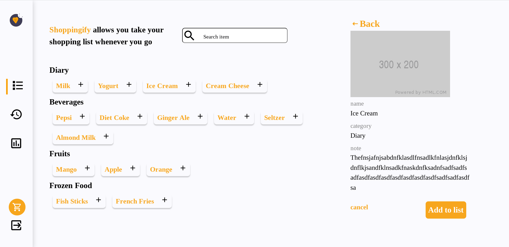

***

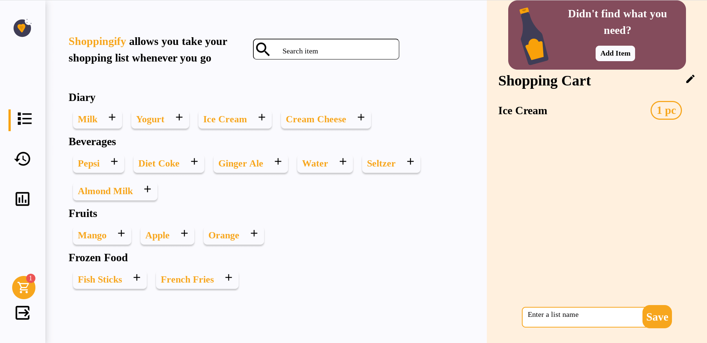

***

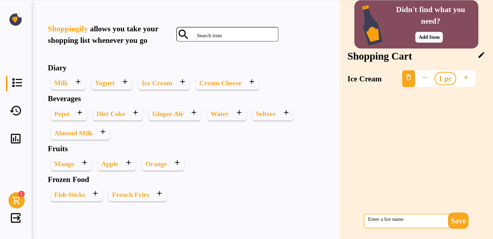

***


***

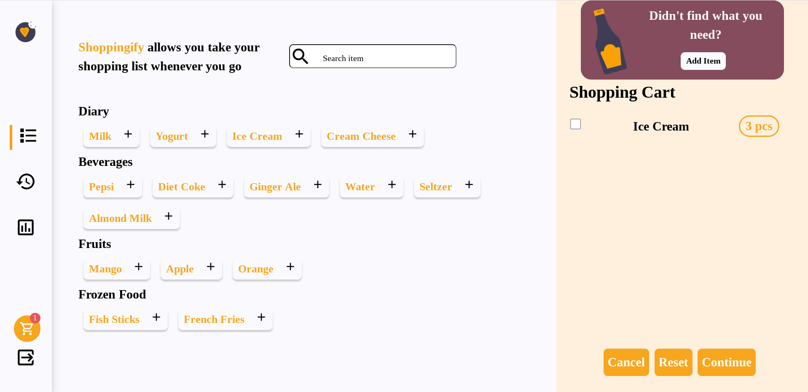

***

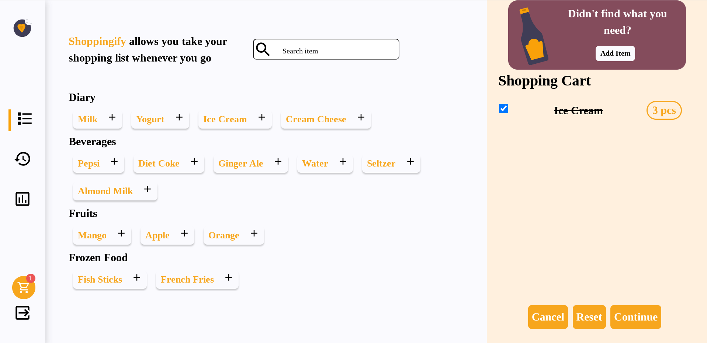

***

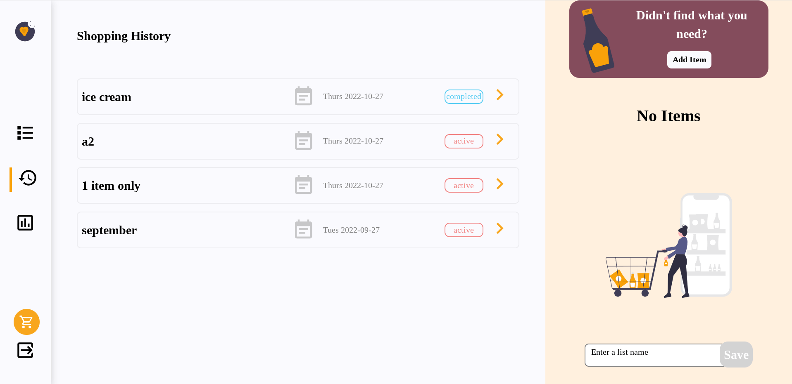

***

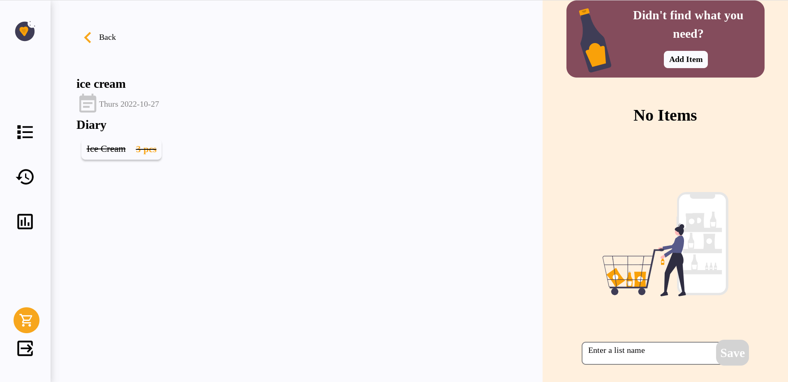

***


***

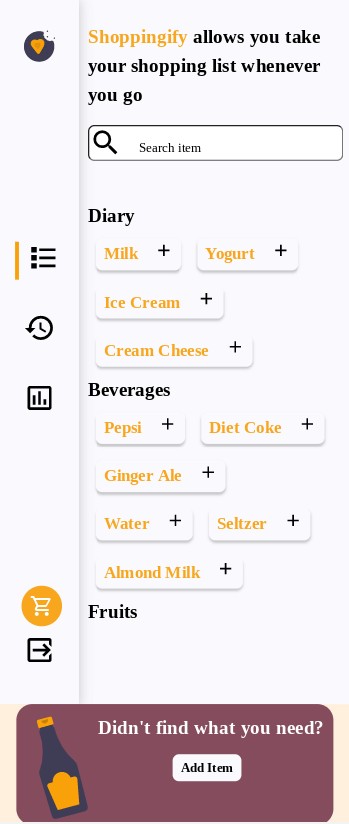

***


***

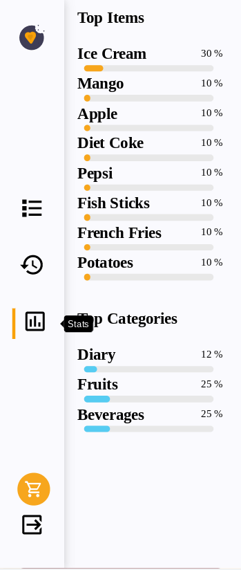

***

### Built With

- [React](https://reactjs.org)
- [Axios](https://axios-http.com)
- [Material Design Icons](https://materialdesignicons.com)
- [Recharts](https://recharts.org/en-US)

## Features

This application/site was created as a submission to a [DevChallenges](https://devchallenges.io/challenges) challenge. The [challenge](https://web.archive.org/web/20231130033807/https://legacy.devchallenges.io/challenges/mGd5VpbO4JnzU6I9l96x) was to build an application to complete the given user stories. **Note**: The previous design document may be incomplete, as you need to find an archived version of the challenge as all `legacy` challenges have had their documentation removed from DevChallenges.

## How To Use

To clone and run this application, you'll need [Git](https://git-scm.com) and [Node.js](https://nodejs.org/en/download/) (which comes with [npm](http://npmjs.com)) installed on your computer. From your command line:

```bash
# Clone this repository & the companion backend repo
$ git clone https://github.com/jdegand/shoppingify-backend.git
$ git clone https://github.com/jdegand/shoppingify-frontend.git

# Install dependencies in both repos
$ npm install

# Add env variables && run both apps (match PORT number with BASE_URL in axios.js) (in browser - enable cookies)
$ npm start
```

## Thoughts

- Added basic testing with Cypress
- Used a `cypress.env.json` for `env` variables in the Cypress tests.
- Need to change username for register test each time - could possibly use nanoid for random value for name but can't reuse that user for login tests easily - have to look up in mongo atlas
- Can install eslint plugin to prevent errors in terminal when looking at the cypress e2e test files
- Home component holds state - pass as props to other components
- Project may have benefited from global state management but I do not think it is necessary
- No categories selection panel
- Build this desktop first - is design really mobile friendly? - mobile styling based on 375px width - did not look at all possible screen sizes - Tweaks are required for most sizes since I used grids with set pixel values vs percentages
- Overflow containers could be annoying on mobile
- Put the item panel after the other 2 sections - easiest mobile solution
- Mobile - ItemDetail comes after the cart - not great at all - scroll to its location?
- Added a scrolling hook but not perfect - doesn't reach top of screen or bottom of screen on first click - issue in hook?
- Problems when resizing as well
- The cart was not designed to be opened and closed and it may require a significant rework if you were to go that route
- I think that would help a lot for mobile - as you could replace the items section with itemDetail or itemPanel components
- Tons of data manipulation done versus more network requests - performance optimizations definitely possible here - useMemo etc
- Stats page - use all lists from all users or per user - I originally had it for all list items and switched to per-user
- Top Categories - categories in lists versus total categories used in all lists
- Top Items - overall percentage of items purchased across all lists (items / total items)
- Had to repeat overflow containers often.
- Had multiple 'missing key' warnings - should be mostly solved - I used nanoid - using map inside of another map, need to give keys to both wrapping divs?
- Could have put navbar and listpanel inside of layout component
- Change navbar tabs to nav-links and add styling for active link
- I went with tab system not tied to react router - using react router preferrable - better for bookmarking & accessbility
- Changing to nav-links requires changing the :/id api routes - using query params vs search params - need to duplicate backend route - one for each approach or could try to use ' req.params.id || req.query.id' logic in route
- The state of the list feature is half-baked - should list be available to update & where ? - in the shopping history detail view ?
- If all items are purchased (crossed-out), the list is complete - otherwise it is active.  Saving a cancelled list makes no sense.
- Nor should saving a list require multiple prompts as design implies - creating friction in the process -> lose users who get tired of the process
- Add toggling of purchased items in the shopping history detail component - the purchased property is present and can be accessed inside of it - I cross out items on list that are purchased - send api request back to update the list and grab list id from url
- Didn't use gray for input labels - harder to see for no real benefit
- Various styling differences - disabled input border, bottle
- Tooltip reminded me -> if something needs to used multiple times -> make a component for it -> this can sometimes slip your mind and you find yourself using multiple state values and multiple handlers
- The ItemDetail Component had a lot of functionality that I kept removing as development progressed - its click handler had to be moved to the Link component otherwise keyboard functionality would have been broken
- Added keyboard functionality for the plus button and item panel - should be able to add items to list and save it all with keyboard - checkbox works with spacebar but not with enter key
- Handle case when no shopping history and no stats to display - right now shows empty chart on stats page
- problem with list names being unique - can't have different users have same list name ? Problem with having list being a separate model ?
- need to wrap nav in a header tag?

## Continued Development

- Styling issues. "Completed" will overflow with present grid in the shopping list history component.
- Refactor some component logic.
- Folder structure improvements
- Look into Cypress test improvements.
- Migrate from Create React App or just update dependencies.

## Useful Resources

- [Stack Overflow](https://stackoverflow.com/questions/56828017/testing-usecontext-with-react-testing-library) - testing useContext
- [Code Sandbox](https://codesandbox.io/s/r4m5jp6jjq) - Vertical React Tabs
- [Stack Overflow](https://stackoverflow.com/questions/11755628/can-i-use-div-as-a-direct-child-of-ul) - div direct child of ul
- [React Router Docs](https://reactrouter.com/en/main/components/nav-link) - nav link
- [Medium](https://medium.com/developer-rants/what-if-height-100vh-is-bigger-than-your-screen-7f39c62ac170) - 100vh overflows
- [React Docs](https://beta.reactjs.org/learn/you-might-not-need-an-effect) - you might not need an effect
- [Codepen](https://codepen.io/manabox/pen/KzzeNy) - subtle box shadow
- [Dev.to](https://dev.to/samba_code/nested-ternary-statements-in-react-jsx-35kp) - nested ternary statements in react
- [Codepen](https://codepen.io/huferr/pen/GRmZJJx) - react tabs
- [React Docs](https://beta.reactjs.org/learn/updating-objects-in-state) - updating objects in state
- [Stack Overflow](https://stackoverflow.com/questions/63614183/react-router-dom-link-how-can-i-put-an-id-into-the-path-of-link) - react router id & links
- [React Router Docs](https://reactrouter.com/en/main/components/link) - link
- [Ultimate Courses](https://ultimatecourses.com/blog/query-strings-search-params-react-router) - search params react router 6
- [Mongoose Docs](https://mongoosejs.com/docs/defaults.html) - mongoose defaults
- [Stack Overflow](https://stackoverflow.com/questions/52954908/add-an-object-with-setstate-to-an-array-of-objects) - add an object with setState to array of objects
- [Stack Overflow](https://stackoverflow.com/questions/71938368/how-to-prevent-adding-duplicate-objects-into-array-in-state-in-reactjs) - prevent duplicate objects in state
- [AppsLoveWorld](https://www.appsloveworld.com/reactjs/200/440/how-to-avoid-pushing-duplicate-objects-in-state-array-in-reactjs) - avoid pushing duplicate objects
- [Stack Overflow](https://stackoverflow.com/questions/8837050/allow-specific-tag-to-override-overflowhidden) - override overflow hidden
- [Stack Overflow](https://stackoverflow.com/questions/35663653/make-a-scrollbar-always-visible-in-a-div-chrome) - make scrollbar always visible
- [FreeCodeCamp](https://www.freecodecamp.org/news/how-to-work-with-multiple-checkboxes-in-react/) - multiple checkboxes in react
- [Stack Overflow](https://stackoverflow.com/questions/32923255/react-checkbox-doesnt-toggle) - checkbox & react
- [Pluralsight](https://www.pluralsight.com/guides/handling-multiple-inputs-with-single-onchange-handler-react) - handling multiple inputs with single onchange handler
- [Stack Overflow](https://stackoverflow.com/questions/11922383/how-can-i-access-and-process-nested-objects-arrays-or-json) - nested object arrays
- [MDN Docs](https://developer.mozilla.org/en-US/docs/Web/JavaScript/Reference/Global_Objects/Array/flat) - array flat
- [Stack Overflow](https://stackoverflow.com/questions/68075339/javascript-find-in-nested-array) - find in nested array
- [YouTube](https://www.youtube.com/watch?v=10CehsAWk7E) - find unique objects in array
- [Stack Overflow](https://stackoverflow.com/questions/51573892/update-state-in-nested-array-react-js) - update state in nested array
- [LearnBestCoding](https://www.learnbestcoding.com/post/56/how-to-update-nested-state-objects-reactjs) - update nested state objects
- [Stack Overflow](https://stackoverflow.com/questions/29537299/how-can-i-update-state-item1-in-state-using-setstate) - how can update state with index
- [Stack Overflow](https://stackoverflow.com/questions/26069238/call-multiple-functions-onclick-reactjs) - call multiple function onclick react
- [Stack Overflow](https://stackoverflow.com/questions/43476729/react-checkbox-does-not-update) - react checkbox not updating
- [Stack Overflow](https://stackoverflow.com/questions/49226450/how-can-i-pass-multiple-props-in-a-single-event-handler-in-reactjs) - multiple props in a single event handler
- [Bobby Hadz](https://bobbyhadz.com/blog/react-router-go-back-to-previous-page#:~:text=To%20go%20back%20to%20the,as%20hitting%20the%20back%20button.) - useNavigate
- [Bobby Hadz](https://bobbyhadz.com/blog/react-remove-query-params) - remove query params
- [Stack Overflow](https://stackoverflow.com/questions/155188/trigger-a-button-click-with-javascript-on-the-enter-key-in-a-text-box) - keyup enter key
- [Stack Overflow](https://stackoverflow.com/questions/41580032/group-the-same-category-objects) - group the same category objects
- [Stack Overflow](https://stackoverflow.com/questions/14446511/most-efficient-method-to-groupby-on-an-array-of-objects) - groupby on an array of objects
- [Stack Overflow](https://stackoverflow.com/questions/56247433/how-to-use-setstate-callback-on-react-hooks) - setState callback with react hooks
- [Stack Overflow](https://stackoverflow.com/questions/70223082/updated-variable-is-not-rendered) - updated variable is not rendered
- [Stack Overflow](https://stackoverflow.com/questions/71804437/how-to-display-the-values-from-a-map-on-a-react-web-app-javascript) - display values from a map object in react
- [ReactTraining](https://reacttraining.com/blog/how-to-use-and-not-use-state/) - react state
- [FreeCodeCamp](https://www.freecodecamp.org/news/iterate-through-nested-object-in-react-js/) - iterate nested object in react
- [Stack Overflow](https://stackoverflow.com/questions/61938375/having-trouble-listing-all-values-of-json-using-map-in-react) - map object & react
- [Stack Overflow](https://stackoverflow.com/questions/40803828/how-can-i-map-through-an-object-in-reactjs) - map through an object in react
- [Bobby Hadz](https://bobbyhadz.com/blog/react-map-nested-array) - react map nested array
- [Stack Overflow](https://stackoverflow.com/questions/53605759/react-setting-state-to-an-es6-map) - react setting state to an es6 map
- [Bobby Hadz](https://bobbyhadz.com/blog/javascript-sum-values-of-object) - sum values of object
- [Stack Overflow](https://stackoverflow.com/questions/44752138/in-react-how-to-pass-a-dynamic-variable-to-a-const-css-style-list) - dynamic variable & react inline style
- [Stack Overflow](https://stackoverflow.com/questions/64671325/how-do-i-set-the-width-of-a-component-in-my-react-web-app-based-off-the-output-o) - width of a component based off a variable react
- [Stack Overflow](https://stackoverflow.com/questions/45100477/how-to-render-a-object-in-react) - render an object in react
- [Bobby Hadz](https://bobbyhadz.com/blog/javascript-count-occurrences-of-each-element-in-array) - count occurrences of each element in array
- [Blog](https://www.paigeniedringhaus.com/blog/build-and-custom-style-recharts-data-charts) - recharts data charts
- [Stack Overflow](https://stackoverflow.com/questions/19480008/javascript-merging-objects-by-id) - merge object by id
- [Stack Overflow](https://stackoverflow.com/questions/70797166/how-to-match-objects-with-the-same-key-value-pairs-passed-as-arguments) - match objects with same key value pair
- [Stack Overflow](https://stackoverflow.com/questions/52311150/find-all-matching-elements-with-in-an-array-of-objects) - matching elements within an array of objects
- [YouTube](https://www.youtube.com/watch?v=Gj0ZOr0N6Ck) - React Charts
- [Stack Overflow](https://stackoverflow.com/questions/6913512/how-to-sort-an-array-of-objects-by-multiple-fields) - sort an array of objects by multiple fields
- [Stack Overflow](https://stackoverflow.com/questions/59269676/change-the-value-of-object-in-an-array-on-click-event) - change value of object in array on click event
- [Stack Overflow](https://stackoverflow.com/questions/59633005/how-is-eslint-integrated-into-create-react-app) - eslint integration with create react app
- [Codepen](https://codepen.io/anon/pen/YwWRVb) - react tooltip (have to add react and reactDOM to see it working) - change end to ReactDOM.render
- [Paladini Blog](https://paladini.dev/posts/how-to-make-an-extremely-reusable-tooltip-component-with-react--and-nothing-else/) - reusable tooltip
- [Codesandbox](https://codesandbox.io/s/how-to-make-an-extremely-reusable-tooltip-component-with-react-and-nothing-else-7opo3?from-embed=&file=/src/App.js) - extremely reusable tooltip component
- [TestCafe](https://testcafe.io/402905/resources/blog/2020-12-28-randomize-your-end-to-end-tests-how-to-generate-input-data-for-testcafe) - randomize e2e tests
- [Reddit](https://www.reddit.com/r/copypasta/comments/78yfyh/wall_of_text/) - wall of text
- [Stack Abuse](https://stackabuse.com/how-to-scroll-to-top-in-react-with-a-button-component/) - scroll
- [Stack Overflow](https://stackoverflow.com/questions/36862334/get-viewport-window-height-in-reactjs) - get viewport width and height
- [Stack Overflow](https://stackoverflow.com/questions/33211672/how-to-submit-a-form-using-enter-key-in-react-js) - submit form on enter key
- [Stack Overflow](https://stackoverflow.com/questions/54579558/clicking-a-link-when-enter-key-is-pressed-using-react) - click a link with keyboard
- [Github](https://github.com/remix-run/react-router/issues/6600) - react router onKeyPress
- [Stack Overflow](https://stackoverflow.com/questions/33850412/merge-javascript-objects-in-array-with-same-key) - merge objects
- [Stack Overflow](https://stackoverflow.com/questions/5732043/how-to-call-reduce-on-an-array-of-objects-to-sum-their-properties) - reduce on array of objects
- [YouTube](https://www.youtube.com/watch?v=6rNIY7W8IZM) - reduce on array of objects
- [Medium](https://vmarchesin.medium.com/using-array-prototype-reduce-in-objects-using-javascript-dfcdae538fc8) - array reduce
- [Stack Overflow](https://stackoverflow.com/questions/29886552/why-are-objects-not-iterable-in-javascript) - objects are not iterable
- [Stack Overflow](https://stackoverflow.com/questions/62219461/merge-same-object-property-name-and-combine-other-properties-in-one-array-object) - merge objects
- [TutorialsPoint](https://www.tutorialspoint.com/add-matching-object-values-in-javascript) - matching object values
- [Stack Overflow](https://stackoverflow.com/questions/65870360/how-to-combine-objects-with-same-value-in-an-array) - combine objects
- [Stack Overflow](https://stackoverflow.com/questions/39966125/using-indexof-to-filter-an-array) - indexOf and filter
- [TutorialsPoint](https://www.tutorialspoint.com/merge-javascript-objects-with-the-same-key-value-and-count-them) - merge js objects
- [Dev.to](https://dev.to/ramonak/javascript-how-to-merge-multiple-objects-with-sum-of-values-43fd) - merge multiple objects
- [Stack Overflow](https://stackoverflow.com/questions/41824462/sum-of-same-object-name-in-javascript) - sum of same object name
- [Stack Overflow](https://stackoverflow.com/questions/24444738/sum-similar-keys-in-an-array-of-objects) - sum similar keys in an array of objects

## Acknowledgements

- [Vitor Paladini](https://github.com/vtrpldn) - reused his tooltip
